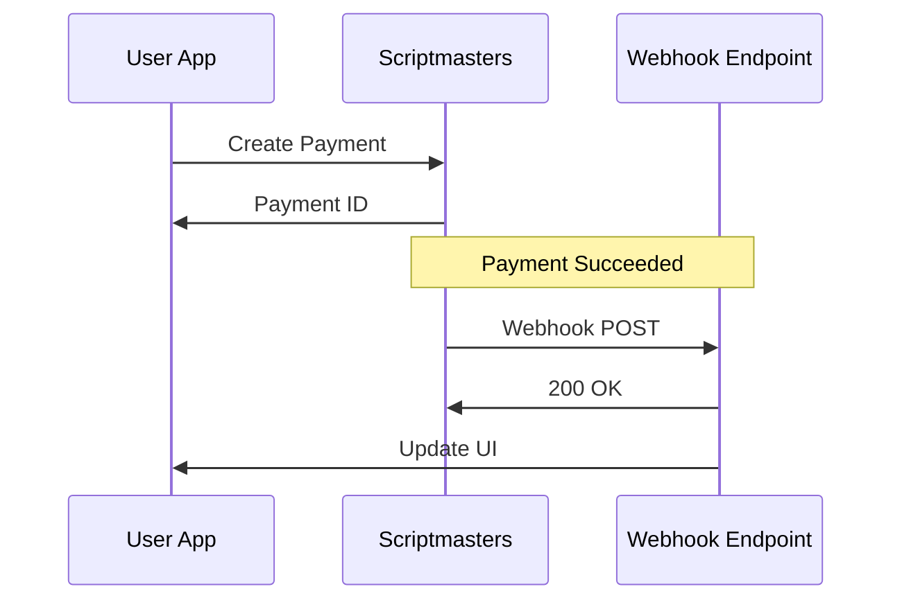

## Overview

Scriptmasters provides flexible integration options to connect with your existing stack. Use webhooks for real-time event notifications, pre-built connectors for e-commerce platforms and CRMs, or the RESTful API for fully custom payment flows. This guide covers setup, best practices, and error handling to ensure seamless data flow.

<Columns cols={3}>
  <Card title="Webhooks" icon="zap" href="#webhooks">
    Receive instant notifications for payment events like approvals and disputes.
  </Card>
  <Card title="E-commerce" icon="shopping-cart" href="#ecommerce">
    Connect to Shopify, WooCommerce, and more with official plugins.
  </Card>
  <Card title="Custom APIs" icon="code" href="#custom-apis">
    Build tailored integrations using our developer-friendly endpoints.
  </Card>
</Columns>

## Setting Up Webhooks

Webhooks deliver real-time updates for events such as `payment.succeeded`, `payment.failed`, and `dispute.created`. Configure them in your Scriptmasters dashboard.

<Steps>
  <Step title="Create Webhook" icon="plus">
    Navigate to the <strong>Integrations</strong> tab in your dashboard. Click <strong>New Webhook</strong> and enter your endpoint URL.
  </Step>
  <Step title="Select Events" icon="settings">
    Choose events to subscribe to. Start with core payment events for testing.
  </Step>
  <Step title="Verify and Test" icon="check-circle">
    Use the built-in test tool to send a sample payload. Check your server logs for receipt.
  </Step>
</Steps>

Handle incoming webhooks securely. Always verify the signature using the shared secret.

<CodeGroup tabs="Node.js,Python">
  ```javascript
  const crypto = require('crypto');

  app.post('/webhook', (req, res) => {
    const signature = req.headers['x-scriptmasters-signature'];
    const payload = JSON.stringify(req.body);
    const expectedSig = 'sha256=' + crypto
      .createHmac('sha256', 'YOUR_WEBHOOK_SECRET')
      .update(payload)
      .digest('hex');

    if (signature !== expectedSig) {
      return res.status(401).send('Invalid signature');
    }

    // Process event
    console.log('Event:', req.body.event);
    res.status(200).send('OK');
  });
  ```
  ```python
  import hmac
  import hashlib
  from flask import Flask, request, abort

  app = Flask(__name__)
  WEBHOOK_SECRET = 'YOUR_WEBHOOK_SECRET'

  @app.route('/webhook', methods=['POST'])
  def webhook():
      signature = request.headers.get('X-Scriptmasters-Signature')
      payload = request.get_data()
      expected_sig = 'sha256=' + hmac.new(
          WEBHOOK_SECRET.encode(),
          payload,
          hashlib.sha256
      ).hexdigest()

      if signature != expected_sig:
          abort(401)

      # Process event
      event = request.json['event']
      print(f'Event: {event}')
      return 'OK', 200
  ```
</CodeGroup>

<Callout kind="tip" title="Security Best Practice">
Always validate webhook signatures to prevent replay attacks. Use HTTPS for your endpoint and implement idempotency with the `id` field.
</Callout>

## E-commerce Platform Integrations

Connect Scriptmasters to popular platforms using official plugins or API webhooks.

<Tabs>
  <Tab title="Shopify" icon="shopping-bag">
    Install the Scriptmasters app from the Shopify App Store.
    
    <Steps>
      <Step title="Install App">
        Search for <strong>Scriptmasters</strong> in Shopify admin and install.
      </Step>
      <Step title="Configure API Key">
        Copy your Scriptmasters API key and paste into Shopify settings.
      </Step>
    </Steps>

    ```liquid
    <!-- Checkout form example -->
    <form action="https://api.example.com/v1/payments" method="POST">
      <input type="hidden" name="api_key" value="{{ shopify_api_key }}">
      <input type="text" name="amount" value="29.99">
      <button type="submit">Pay Now</button>
    </form>
    ```
  </Tab>
  <Tab title="WooCommerce" icon="wordpress">
    Use the Scriptmasters WooCommerce plugin.
    
    1. Download from WordPress.org.
    2. Activate and enter your merchant ID.
    3. Map payment methods in WooCommerce > Settings > Payments.
    
    <ParamField query="api_key" param-type="string" required="true">
      Your Scriptmasters API authentication key.
    </ParamField>
  </Tab>
</Tabs>

## Building Custom Payment Flows

For advanced use cases, integrate directly via the Scriptmasters API at `https://api.example.com/v1`.

<Request tabs="cURL,JavaScript" show-lines="true">
  ```bash
  curl https://api.example.com/v1/payments \
    -H "Authorization: Bearer YOUR_API_KEY" \
    -H "Content-Type: application/json" \
    -d '{
      "amount": 2999,
      "currency": "USD",
      "customer": {
        "email": "user@example.com"
      },
      "metadata": {"order_id": "ORD-123"}
    }'
  ```
  ```javascript
  const response = await fetch('https://api.example.com/v1/payments', {
    method: 'POST',
    headers: {
      'Authorization': 'Bearer YOUR_API_KEY',
      'Content-Type': 'application/json'
    },
    body: JSON.stringify({
      amount: 2999,
      currency: 'USD',
      customer: { email: 'user@example.com' },
      metadata: { order_id: 'ORD-123' }
    })
  });
  const payment = await response.json();
  ```
</Request>

<Response tabs="200,400">
  ```json
  {
    "id": "pay_abc123",
    "status": "succeeded",
    "amount": 2999,
    "currency": "USD"
  }
  ```
  ```json
  {
    "error": {
      "code": "invalid_amount",
      "message": "Amount must be positive"
    }
  }
  ```
</Response>

<ResponseField name="id" field-type="string" required="true">
  Unique payment identifier.
</ResponseField>

## Data Synchronization and Error Recovery

Maintain data consistency across systems with retry logic and idempotency.

<Expandable title="Advanced Error Handling" default-open="false">
Implement exponential backoff for retries:

```javascript
async function retryPaymentSync(id, maxRetries = 3) {
  for (let attempt = 1; attempt <= maxRetries; attempt++) {
    try {
      await syncPayment(id);
      return;
    } catch (error) {
      const delay = Math.pow(2, attempt) * 1000;
      await new Promise(resolve => setTimeout(resolve, delay));
    }
  }
}
```

Use the `idempotency_key` header to safely retry requests without duplicates.
</Expandable>

<Callout kind="alert" title="Common Pitfall">
Monitor webhook delivery rates in the dashboard. If failures exceed 5%, check your endpoint's uptime and response times under `<2s`.
</Callout>

